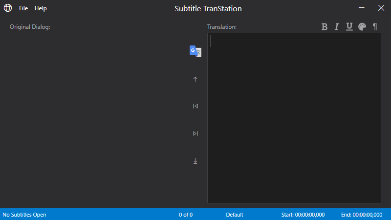

<h3 align="center">Subtitle TranStation</h3>
<p align="center"></p>
  <p align="center">
    An simple station for an easy and fast subtitle translation.    
    <br />
    <br />    
    <a href="https://github.com/MawCeron/subtranstation/issues">Report Bug</a>
    ·
    <a href="https://github.com/MawCeron/subtranstation/issues">Request Feature</a>
  </p>


<!-- ABOUT THE PROJECT -->
## About The Project

There are many great subtitle editors out there, however, when all you want is just to translate those subtitles into another language all the other features are mainly innecesary and in many occasions it prolongs the time that takes to make and save the translation.

This project tries to solve this improving the translation process focusing just in the dialogues, and the necessary tools to work with it.

### Features
#### v0.1.0
* Supported files:
    * TXT (Plain Text)
    * SRT (SubRip)
    * ASS, SSA (SubStation Alpha)
* Open and save current translation (TRA files).
* Keeps the subtitles timing.
* Keeps the styles and characters in ASS files.
* Translation suggestion for dialogues via Google Translate.
* Moving between dialogues (first, previous, next, last).
* Next dialogue when Enter key is pressed in the translation textbox.
* Subtitle text format:
    * Bold
    * Italic
    * Underline
    * Font color
    * Linebreaks
* Exports to:
    * TXT (Plain Text)
    * SRT (SubRip)
    * ASS, SSA (SubStation Alpha)
    
<!-- GETTING STARTED -->
## Getting Started

To get a local copy you can clone the repo:
```sh
git clone https://github.com/MawCeron/subtranstation.git
```
Or just download the [latest release](https://github.com/MawCeron/subtranstation/releases).

<!-- CONTRIBUTING -->
## Contributing

Contributions are what make the open source community such an amazing place to be learn, inspire, and create. This project, just like many others, is far from perfect, any contributions you make are **greatly appreciated**.

1. Fork the Project
2. Create your Feature Branch (`git checkout -b feature/AmazingFeature`)
3. Commit your Changes (`git commit -m 'Add some AmazingFeature`)
4. Push to the Branch (`git push origin feature/AmazingFeature`)
5. Open a Pull Request

<!-- LICENSE -->
## License

Distributed under the MIT License. See `LICENSE` for more information.
